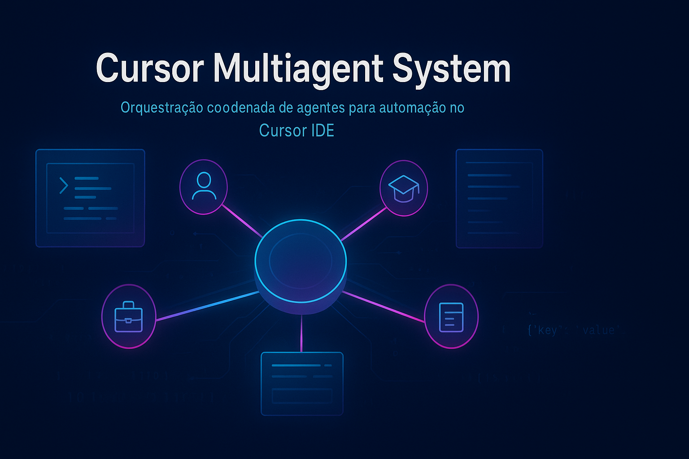

<div align="center">
  
</div>

<div align="center">
  <a href="https://github.com/LucasBiason/cursor-multiagent-system/releases"></a>
  <a href="https://github.com/LucasBiason/cursor-multiagent-system/blob/main/requirements.txt"></a>
  <a href="https://github.com/LucasBiason/cursor-multiagent-system/actions"></a>
  <a href="LICENSE"></a>
</div>

# 🤖 Cursor Multiagent System

A production-ready framework for coordinated AI agent systems in Cursor IDE 2.0.

## 📋 Overview

This project provides a modular architecture for creating and managing multiple specialized AI agents that work together to automate workflows, manage tasks, and improve productivity.

## 📊 Project Status

**Version:** 1.2.0  
**Repository:** [github.com/LucasBiason/cursor-multiagent-system](https://github.com/LucasBiason/cursor-multiagent-system)  
**Status:** 🚀 Active Development

## 🏗️ Architecture

The system consists of 4 main specialized agents:

1. **👤 Personal Assistant** - Entry point, manages agenda, tasks, and Notion workspace
2. **📚 Studies Assistant** - Teaching, project guidance, senior programming expertise for learning
3. **💼 Work Assistant** - Co-programming, code review, testing, deployment automation
4. **📱 Social Media Assistant** - Content strategy for StuffsCode (Instagram + YouTube)

All agents:
- ✅ Monitor and update Notion databases
- 📅 Check calendar and timeboxes
- 🎯 Create/update cards automatically
- ⏰ Respect schedule impacts

## Directory Structure

```
cursor-multiagent-system/
├── core/                    # Public framework (reusable)
│   ├── templates/          # Agent templates
│   ├── schemas/            # Configuration schemas
│   ├── docs/              # Documentation
│   ├── utils/             # Utility scripts
│   └── examples/          # Usage examples
│
├── config/                 # Private configurations
│   ├── agents/            # Agent definitions
│   ├── workflows/         # Workflow definitions
│   ├── rules/             # Business rules
│   └── private/           # Sensitive data
│
├── scripts/               # Utility scripts
├── tests/                 # Test suite
└── .cursor/              # Cursor IDE configs
```

## ✨ Key Features

- 🔗 **Unified Context**: All agents share knowledge and state
- 📝 **Notion Integration**: Deep integration with Notion workspace
- ⚙️ **Workflow Automation**: Background tasks and scheduled jobs
- 🧩 **Modular Design**: Easy to extend and customize
- 🔒 **Privacy First**: Clear separation between public and private data

## 🚀 Quick Start

### 📦 Prerequisites

- 🖥️ Cursor IDE 2.0+
- 🐍 Python 3.11+
- 🔑 Notion API access

### 💻 Installation

#### 1️⃣ Clone the Repository

```bash
# Clone the public repository
git clone https://github.com/LucasBiason/cursor-multiagent-system.git
cd cursor-multiagent-system
```

**⚠️ Note:** The `config/` folder will be **EMPTY** (only `.git` file) after initial clone.

#### 2️⃣ Initialize Private Submodule

The private configuration is stored in a separate private repository as a git submodule:

```bash
# Initialize and clone the private submodule
git submodule update --init --recursive
```

**Behavior:**
- ✅ If you **HAVE ACCESS** to the private repository:
  - Git will clone `https://github.com/LucasBiason/cursor-multiagent-private.git`
  - If authenticated on GitHub, it will clone normally
  - The `config/` folder will be populated with all content

- ❌ If you **DON'T HAVE ACCESS** to the private repository:
  - You'll get an authentication/permission error
  - The `config/` folder will remain empty

#### 3️⃣ Authentication Required

To clone the private submodule, you need:

1. **🔐 Be authenticated on GitHub:**
   ```bash
   gh auth login
   # or
   git config --global credential.helper store
   ```

2. **👥 Have access to the private repository:**
   - The repository `cursor-multiagent-private` must be in your repository list
   - Or you must be a collaborator on the repository

#### 4️⃣ Alternative: Clone with Submodules

```bash
# Clone everything at once
git clone --recurse-submodules https://github.com/LucasBiason/cursor-multiagent-system.git
```

#### 5️⃣ Install Dependencies

```bash
# Install Python dependencies
pip install -r requirements.txt

# Setup configuration
./scripts/setup.sh

# Validate setup
./scripts/validate.sh
```

### ⚙️ Configuration

#### 1️⃣ Set Environment Variables

```bash
# Set Notion API key (if using Notion integration)
export NOTION_API_KEY="your_notion_api_key"

# Or use .env file
cp core/config/.env.example core/config/.env.passwords
# Edit core/config/.env.passwords with your credentials
```

#### 2️⃣ Configure Notion (if using Notion integration)

Edit Notion database IDs in `config/system/infrastructure/notion-ids.json`:
- 👤 Personal database ID
- 📚 Studies database ID
- 💼 Work database ID
- 🎬 Youtuber database ID

#### 3️⃣ Configure Cursor IDE

```bash
# Link agents directory (if needed)
ln -s $(pwd)/core/agents ~/.cursor/agents
```

## 🎯 Creating Your First Agent

### Step 1️⃣: Generate from Template

```bash
mkdir -p core/agents
cp core/templates/agent-template.mdc core/agents/my-agent.mdc
```

### Step 2️⃣: Edit Agent File

Edit `core/agents/my-agent.mdc`:

```markdown
---
alwaysApply: false
---

# My Agent

## Role
You are a [description of your agent's role]

## Responsibilities
- Task 1
- Task 2
- Task 3

## Examples
[Add usage examples]
```

### Step 3️⃣: Test Your Agent

In Cursor, try mentioning your agent or using keywords defined in the agent file.

## 🎮 Using the System

### 📝 Basic Usage

Simply talk to Cursor naturally:

```
"Show my agenda for today"
"Help me with this project"
"Create a task for tomorrow"
"What should I work on next?"
```

Cursor Composer will:
1. 🔍 Analyze your request
2. 🤖 Activate appropriate agent(s)
3. ⚡ Execute actions
4. 📊 Return consolidated results

### 🎯 Specific Agent

Call a specific agent using `@agent-name`:

```
@personal-assistant create task for tomorrow
@studies-assistant help with ML project
@work-assistant review this code
```

### 💡 Examples

#### 📋 Example 1: Task Management

```
You: "Create task: Review code tomorrow at 14:00"

System:
- 👤 Activates Personal Assistant
- ✅ Creates task in Notion
- ⏰ Sets reminder
- ✨ Confirms creation
```

#### 🤝 Example 2: Multi-Agent Coordination

```
You: "Prepare my week"

System:
- 👤 Activates Personal Assistant
- 🔄 Delegates to multiple agents:
  - 📝 Create weekly cards
  - ⚠️ Check for overdue tasks
  - 📊 Generate weekly report
- 🔗 Consolidates results
- 📈 Shows summary
```

#### 🔄 Example 3: Context Switching

```
You: "Help with ML project"
→ 📚 Studies Assistant activated

You: "Hold on, fix this bug first"
→ 💼 Work Assistant activated (Studies Assistant paused)

You: "OK, back to ML"
→ 📚 Studies Assistant resumed (exactly where you left off)
```

### 📁 Repository Structure

After complete clone:

```
cursor-multiagent-system/
├── .gitmodules          # Submodule configuration
├── config/              # Private submodule (git repository)
│   ├── .git            # Link to private repository
│   ├── CONTEXTO_GERAL.md
│   ├── CONTEXTO_ESTUDOS.md
│   ├── CONTEXTO_TRABALHO.md
│   └── ... (all private files)
├── core/                # Public framework
│   ├── agents/         # Agent definitions (.mdc files)
│   ├── templates/      # Templates
│   └── docs/           # Documentation
├── scripts/            # Utility scripts
└── ... (other public files)
```

### 🔄 Updating the Submodule

```bash
# Update submodule to latest version
cd config
git pull origin main
cd ..
git add config
git commit -m "Update submodule"
```

### 🔧 Troubleshooting

#### ❌ Installation Issues

**Error: "Permission denied"**
- 🔐 Verify you're authenticated on GitHub: `gh auth status`
- 👥 Verify you have access to the private repository

**Error: "Repository not found"**
- 🚫 The private repository doesn't exist or you don't have access
- 🔍 Check the URL in `.gitmodules`

**Submodule empty after clone**
- ⚙️ Execute: `git submodule update --init --recursive`
- 🔐 Check authentication: `gh auth status`

#### 🤖 Agent Issues

**Agents Not Activating**
- 📁 Check agent file exists in `core/agents/`
- ✅ Verify agent file has correct format (`.mdc` extension)
- 🎯 Ensure Cursor Composer is enabled
- 📝 Check agent file syntax (YAML frontmatter, markdown)

**Context Not Shared**
- ⚙️ Verify `alwaysApply: true` in agent file if needed
- 🖥️ Check Cursor 2.0 or higher is installed
- 🔗 Verify unified history is enabled in Cursor settings

#### 📝 Notion Integration Issues

**Notion API Errors**
- 🔑 Verify `NOTION_API_KEY` is set correctly
- 📋 Check database IDs in `config/system/infrastructure/notion-ids.json`
- 🌍 Ensure timezone is GMT-3 (never UTC)
- ✅ Verify API key has proper permissions
- 🖥️ Check MCP server is running: `scripts/notion-mcp.sh`

**Database Not Found**
- ✅ Verify database IDs are correct
- 📊 Check database exists in your Notion workspace
- 🔐 Ensure API key has access to the databases

### 📊 System Status

**🔒 Private Repository:**
- ✅ Created and configured
- 🔗 URL: https://github.com/LucasBiason/cursor-multiagent-private
- 🔐 Visibility: Private
- 🌿 Branch: main

**📦 Submodule:**
- ✅ Configured in `.gitmodules`
- 🔗 URL: `https://github.com/LucasBiason/cursor-multiagent-private.git`
- 📁 Path: `config/`
- ✅ Status: Synchronized

**💾 Auto-Save System:**
- ✅ `scripts/save_context.py` - Python script
- ✅ `scripts/save-context.sh` - Shell script
- 🔄 Auto-commits to private repository
- 📝 Creates session files in `config/sessions/`

## 📚 Documentation

### 🚀 Getting Started
- 📖 [Documentação do Projeto](docs/README.md)
- 📘 [Guia Completo](README.md#quick-start) (neste arquivo)

### 💻 Development
- 🔢 [Versioning Guide](core/docs/VERSIONING_GUIDE.md)
- 🤝 [Contributing Guidelines](CONTRIBUTING.md)
- 📋 [Changelog](CHANGELOG.md)

### 🏗️ Core Framework
- 📝 [Notion Documentation](core/docs/notion/README.md)
- 📋 [Task Manager Example](core/examples/task-manager/README.md)

### 💡 Programming Best Practices
- 📚 [Complete Guide](core/docs/programming/BEST_PRACTICES.md) - Guia completo de boas práticas
- 🐍 [Python Guide](core/docs/programming/python/README.md) - Python, Django, FastAPI
- 🎯 [Django Best Practices](core/docs/programming/python/django-best-practices.md) - Padrões Django na prática
- ⚡ [FastAPI Best Practices](core/docs/programming/python/fastapi-best-practices.md) - Padrões FastAPI na prática
- 🧪 [Testing Best Practices](core/docs/programming/python/testing-best-practices.md) - Testes e TDD
- 🐳 [Docker Best Practices](core/docs/programming/devops/docker-best-practices.md) - Docker, Compose, Entrypoint, Makefile
- ✨ [Code Quality Guide](core/docs/programming/code-quality.md) - Clean Code, nomenclatura, funções, DRY
- ⚛️ [TypeScript/React Guide](core/docs/programming/typescript/README.md) - Frontend best practices
- 🎨 [Frontend Ecosystem](core/docs/programming/typescript/frontend-ecosystem.md) - React avançado, estado, performance, testes
- 🌐 [API REST Guide](core/docs/programming/api-rest/README.md) - API REST patterns
- 🏛️ [Architecture Patterns](core/docs/programming/architecture/README.md) - Repository, Controller, Validators
- 🔀 [Git Workflow](core/docs/programming/git/README.md) - Git best practices
- 🔒 [Security Guide](core/docs/programming/security/README.md) - Security practices

## 🤖 Agents

### 1️⃣ 👤 Personal Assistant

Entry point for all interactions. Manages:
- 📅 Daily agenda and schedule
- 📝 Notion workspace (4 bases: Personal, Studies, Work, YouTube)
- ✅ Task creation and updates
- ⏰ Calendar and timeboxes
- 🔗 Coordination with other agents

### 2️⃣ 📚 Studies Assistant

Teaching and project guidance:
- 🤖 IA/ML concepts and tutorials
- 🎓 Project-based learning
- 👀 Code reviews for learning projects
- 📅 Study schedule management
- 🎓 FIAP coursework assistance

### 3️⃣ 💼 Work Assistant

Professional development support:
- 👥 Co-programming sessions
- 🔍 Code review and testing
- 🚀 Deployment automation
- 🔀 Git workflow management
- 💰 ExpenseIQ project support

### 4️⃣ 📱 Social Media Assistant

Content strategy and management for TWO channels:

**🦊 The Crazy Fox** (YouTube):
- 🎮 Gaming channel with daily uploads
- 📺 Series management and production
- ⏰ Recording schedule optimization
- 🎬 Base YOUTUBER (exclusive)

**💻 StuffsCode** (Instagram):
- 📚 Programming content and tutorials
- 🎨 AI-generated post images
- 📅 Content calendar and automation
- 📚 Base STUDIES (temporary)

## 🧪 Pilot Phase (November 2024)

Goals:
- ✅ Validate productivity improvements
- 🔄 Refine agent interactions
- ⚡ Optimize workflows
- 📚 Document best practices
- ⏱️ Measure time savings

## 🔒 Privacy & Security

All sensitive data is:
- 🔐 Stored in `config/` (private submodule)
- 🚫 Ignored by git (see `.gitignore`)
- ❌ Never committed to repository
- 💾 Backed up separately

Public repository contains only:
- 📋 Generic templates
- 📚 Documentation
- 🛠️ Reusable utilities
- 💡 Example configurations

## 💻 Development

### 🔄 Workflow

```bash
# 1. Make your changes
# 2. Test locally
./scripts/validate.sh

# 3. Commit and push (automated script)
./scripts/commit-and-push.sh "feat: add new feature"
```

### 🧪 Testing

```bash
# Run all tests
pytest tests/

# Validate configurations
./scripts/validate.sh
```

## 🤝 Contributing

Contributions to improve the framework are welcome! Please read the [Contributing Guidelines](CONTRIBUTING.md) and [Versioning Guide](core/docs/VERSIONING_GUIDE.md) first.

### 🚀 Quick Contribution Guide

1. 🍴 Fork the repository
2. 🌿 Create a feature branch
3. ✏️ Make your changes
4. ✅ Test thoroughly
5. 🔄 Submit a pull request

See [CONTRIBUTING.md](CONTRIBUTING.md) for detailed guidelines.

## 📄 License

MIT License - See LICENSE file for details

## 👤 Author

**Lucas Biason**  
🔗 GitHub: [@lucasbiason](https://github.com/lucasbiason)

## 🙏 Acknowledgments

- 🖥️ Built for Cursor IDE 2.0
- 🤖 Inspired by multi-agent systems and agentic AI patterns
- 📝 Notion API for workspace integration

---

**Last Updated:** 2025-12-08  
**Version:** 1.2.0  
**Repository:** https://github.com/LucasBiason/cursor-multiagent-system


