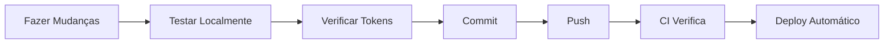

# Guia de Versionamento

Este documento descreve o processo de versionamento e controle de código do Cursor Multiagent System.

## Repositório GitHub

**URL**: https://github.com/LucasBiason/cursor-multiagent-system

**Branch Principal**: `main`

## Semantic Versioning

Este projeto segue [Semantic Versioning 2.0.0](https://semver.org/spec/v2.0.0.html):

- **MAJOR** (X.0.0): Mudanças incompatíveis na API
- **MINOR** (x.Y.0): Novas funcionalidades compatíveis
- **PATCH** (x.y.Z): Correções de bugs compatíveis

### Exemplos

- `1.0.0` → `1.1.0`: Nova funcionalidade adicionada
- `1.1.0` → `1.1.1`: Bug corrigido
- `1.1.1` → `2.0.0`: Mudança que quebra compatibilidade

## Processo de Commit

### Usando o Script Automatizado (Recomendado)

```bash
./scripts/commit-and-push.sh "tipo: descrição da mudança"
```

O script automaticamente:
1. Verifica se há alterações
2. Adiciona todos os arquivos ao staging
3. Verifica por tokens sensíveis
4. Cria o commit
5. Faz push para o GitHub

### Manual

```bash
# 1. Adicionar arquivos
git add -A

# 2. Commit com mensagem descritiva
git commit -m "tipo: descrição da mudança"

# 3. Push para GitHub
git push origin main
```

## Convenção de Mensagens de Commit

Seguimos [Conventional Commits](https://www.conventionalcommits.org/):

### Tipos de Commit

- **feat**: Nova funcionalidade
- **fix**: Correção de bug
- **docs**: Mudanças na documentação
- **style**: Formatação, sem mudança de código
- **refactor**: Refatoração de código
- **perf**: Melhoria de performance
- **test**: Adição ou correção de testes
- **chore**: Tarefas de manutenção
- **ci**: Mudanças em CI/CD
- **build**: Mudanças no sistema de build

### Exemplos

```bash
feat: add new workflow engine
fix: correct agent context loading
docs: update installation guide
refactor: simplify configuration system
chore: update dependencies
```

### Commits com Breaking Changes

Para mudanças que quebram compatibilidade:

```bash
feat!: redesign agent configuration format

BREAKING CHANGE: Agent configuration now uses YAML instead of JSON
```

## Changelog

O arquivo `CHANGELOG.md` deve ser atualizado para cada versão seguindo o formato [Keep a Changelog](https://keepachangelog.com/):

### Estrutura

```markdown
## [X.Y.Z] - YYYY-MM-DD

### Added
- Novas funcionalidades

### Changed
- Mudanças em funcionalidades existentes

### Deprecated
- Funcionalidades marcadas para remoção

### Removed
- Funcionalidades removidas

### Fixed
- Correções de bugs

### Security
- Correções de segurança
```

### Atualizando o Changelog

Sempre que houver mudanças significativas:

1. Abra `CHANGELOG.md`
2. Adicione nova seção para a versão
3. Liste as mudanças nas categorias apropriadas
4. Atualize a data

## Releases

### Criando uma Release

1. **Atualizar versão nos arquivos**
   - Atualizar `CHANGELOG.md`
   - Atualizar número de versão em documentação

2. **Commit e Tag**
   ```bash
   git commit -m "chore: release v1.2.0"
   git tag -a v1.2.0 -m "Release version 1.2.0"
   git push origin main --tags
   ```

3. **Criar Release no GitHub**
   - Ir para https://github.com/LucasBiason/cursor-multiagent-system/releases
   - Clicar em "Create a new release"
   - Selecionar a tag criada
   - Adicionar título: "v1.2.0 - Nome da Release"
   - Copiar conteúdo relevante do CHANGELOG
   - Publicar release

## Segurança

### Proteção de Tokens

O repositório tem **Push Protection** ativado que bloqueia:
- Tokens de API do Notion
- Chaves de API em geral
- Senhas e credenciais

### Verificação Manual

Antes de commitar, sempre verificar:

```bash
# Verificar diff antes de commitar
git diff

# Procurar por tokens
grep -r "ntn_" .
grep -r "secret_" .
grep -r "password" .
```

### Placeholders Seguros

Use sempre placeholders em documentação:

```python
# ✗ ERRADO - Nunca commite tokens reais
TOKEN = 'ntn_ABC123XYZ456REAL_TOKEN_HERE'

# ✓ CORRETO - Use placeholders
TOKEN = 'ntn_YOUR_NOTION_TOKEN_HERE'
```

## Branching Strategy

Atualmente usamos **trunk-based development** com branch principal `main`.

### Para Contribuições Futuras

1. **Fork** o repositório
2. Criar **feature branch**: `git checkout -b feature/nome-da-feature`
3. Fazer commits com mensagens descritivas
4. **Push** para seu fork
5. Abrir **Pull Request** para `main`

## Workflow de Desenvolvimento



## Ferramentas de Verificação

### Scripts Disponíveis

```bash
# Validar configuração
./scripts/validate.sh

# Setup inicial
./scripts/setup.sh

# Commit e push automatizado
./scripts/commit-and-push.sh "mensagem"
```

## Resolução de Problemas

### Token Detectado no Push

Se o push for bloqueado por token:

1. Remover o token do código
2. Substituir por placeholder
3. Reescrever histórico se necessário:
   ```bash
   git filter-branch --tree-filter 'find . -type f -name "*.md" -exec sed -i "s/TOKEN_ANTIGO/TOKEN_PLACEHOLDER/g" {} \;' -- --all
   ```
4. Force push: `git push --force origin main`

### Conflitos de Merge

```bash
# Atualizar branch local
git pull origin main

# Resolver conflitos manualmente
# Editar arquivos marcados com conflito

# Adicionar arquivos resolvidos
git add .

# Continuar merge
git commit
```

## Melhores Práticas

1. **Commits pequenos e frequentes**: Melhor que um commit grande
2. **Mensagens descritivas**: Explique o "porquê", não apenas o "o quê"
3. **Teste antes de commitar**: Valide mudanças localmente
4. **Atualize o CHANGELOG**: Mantenha histórico de mudanças
5. **Revise antes do push**: Use `git diff` para verificar
6. **Nunca commite secrets**: Use variáveis de ambiente

## Recursos

- [Git Documentation](https://git-scm.com/doc)
- [GitHub Flow](https://guides.github.com/introduction/flow/)
- [Conventional Commits](https://www.conventionalcommits.org/)
- [Keep a Changelog](https://keepachangelog.com/)
- [Semantic Versioning](https://semver.org/)

---

**Última Atualização**: 2025-10-31

