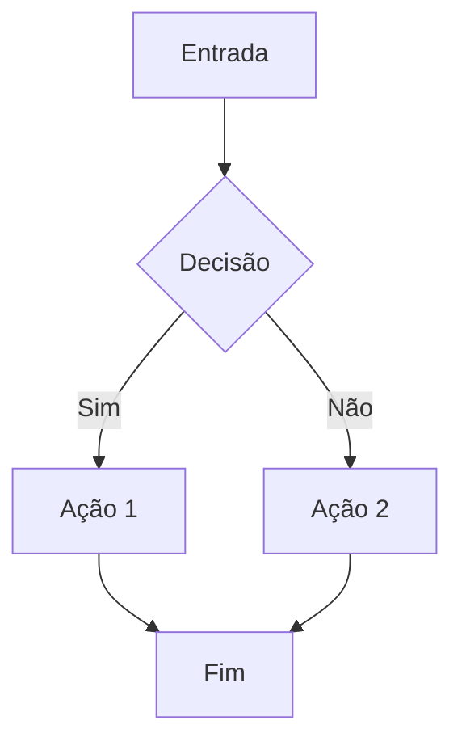
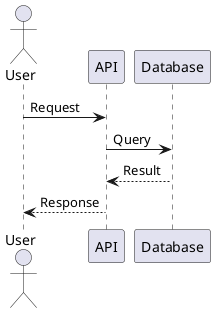

# Geração de Diagramas Técnicos

Padrões e ferramentas para criar diagramas em projetos de documentação técnica.

## Quando Usar

- Tutoriais que precisam de fluxogramas
- Artigos técnicos com diagramas de arquitetura
- Documentação de APIs com diagramas de sequência
- Knowledge Base com visualizações de conceitos

## Ferramentas Recomendadas

## APIs Disponíveis

### OpenAI DALL-E

```python
import openai

response = openai.images.generate(
    model="dall-e-3",
    prompt="Diagrama ilustrativo de algoritmo de ordenação bubble sort",
    size="1024x1024",
    quality="standard"
)
```

### Gemini (Nano Banana)

```python
import google.generativeai as genai

genai.configure(api_key=os.getenv("GEMINI_API_KEY"))
model = genai.GenerativeModel('gemini-2.5-flash-image')

response = model.generate_content(
    "Crie um diagrama ilustrativo de algoritmo de ordenação"
)
```

---

## Mermaid (Para Diagramas Técnicos)

**Para diagramas técnicos, usar Mermaid (não precisa de API):**

Sintaxe declarativa que renderiza direto no GitHub/GitLab.



**Tipos de diagrama:**
- `flowchart` - Fluxogramas
- `sequenceDiagram` - Diagramas de sequência
- `classDiagram` - Diagramas de classe
- `erDiagram` - Diagramas ER
- `gantt` - Cronogramas
- `pie` - Gráficos de pizza
- `stateDiagram` - Máquinas de estado

### 2. PlantUML

Mais flexível, precisa de servidor ou extensão.



### 3. Excalidraw

Diagramas com visual de desenho à mão. Exporta PNG/SVG.

### 4. Draw.io (diagrams.net)

Editor visual completo. Arquivos .drawio são XML editável.

### 5. Python (Matplotlib/Graphviz)

Para diagramas programáticos ou gerados a partir de dados.

```python
import matplotlib.pyplot as plt
import networkx as nx

G = nx.DiGraph()
G.add_edges_from([("A", "B"), ("B", "C"), ("A", "C")])
nx.draw(G, with_labels=True)
plt.savefig("diagram.png")
```

## Padrões por Tipo de Conteúdo

### Tutoriais

| Tipo | Ferramenta | Formato |
|------|------------|---------|
| Fluxo de passos | Mermaid flowchart | Inline no MD |
| Arquitetura simples | Mermaid | Inline no MD |
| Arquitetura complexa | Draw.io | PNG exportado |
| Conceitos abstratos | Excalidraw | PNG exportado |

### Artigos Técnicos

| Tipo | Ferramenta | Formato |
|------|------------|---------|
| Sequência de chamadas | Mermaid sequence | Inline |
| Classes/Estruturas | Mermaid class | Inline |
| Banco de dados | Mermaid ER | Inline |
| Infra/Cloud | Draw.io | PNG |

### Knowledge Base

| Tipo | Ferramenta | Formato |
|------|------------|---------|
| Mapas mentais | Excalidraw | PNG |
| Hierarquias | Mermaid flowchart | Inline |
| Comparações | Tabelas MD | Texto |
| Timelines | Mermaid gantt | Inline |

## Templates Mermaid

### Fluxograma de Decisão

```
flowchart TD
    START([Início]) --> CHECK{Condição?}
    CHECK -->|Verdadeiro| ACTION1[Executar A]
    CHECK -->|Falso| ACTION2[Executar B]
    ACTION1 --> END([Fim])
    ACTION2 --> END
```

### Diagrama de Sequência

```
sequenceDiagram
    participant C as Cliente
    participant S as Servidor
    participant D as Database

    C->>S: POST /api/data
    S->>D: INSERT INTO...
    D-->>S: OK
    S-->>C: 201 Created
```

### Diagrama de Classes

```
classDiagram
    class Animal {
        +String nome
        +int idade
        +comer()
        +dormir()
    }
    class Cachorro {
        +latir()
    }
    Animal <|-- Cachorro
```

### Diagrama ER

```
erDiagram
    USER ||--o{ ORDER : places
    ORDER ||--|{ ITEM : contains
    USER {
        int id PK
        string email
        string name
    }
    ORDER {
        int id PK
        int user_id FK
        date created_at
    }
```

### Arquitetura de Sistema

```
flowchart LR
    subgraph Frontend
        A[React App]
    end
    subgraph Backend
        B[API Gateway]
        C[Auth Service]
        D[Core Service]
    end
    subgraph Data
        E[(PostgreSQL)]
        F[(Redis)]
    end

    A --> B
    B --> C
    B --> D
    C --> E
    D --> E
    D --> F
```

## Convenções de Estilo

### Cores (para ferramentas que suportam)

- Azul: Componentes de entrada/usuário
- Verde: Processamento/lógica
- Amarelo: Decisões/condicionais
- Vermelho: Erros/alertas
- Cinza: Componentes externos

### Nomenclatura

- Usar verbos para ações: "Processar", "Validar", "Enviar"
- Usar substantivos para componentes: "Servidor", "Database", "Cache"
- Manter consistência: não misturar português e inglês no mesmo diagrama

### Tamanho

- Fluxogramas: máximo 10-15 nós
- Sequência: máximo 5-6 participantes
- Se ficar grande demais, dividir em múltiplos diagramas

## Workflow de Criação

1. Definir objetivo do diagrama
2. Listar componentes/passos principais
3. Escolher ferramenta apropriada
4. Criar rascunho simples
5. Refinar e adicionar detalhes
6. Exportar no formato correto
7. Testar renderização no destino final

## Integração com Knowledge Base

Para o projeto Engineering Knowledge Base:

```
engineering-knowledge-base/
└── [seção]/
    └── [tutorial]/
        ├── README.md          # Texto com diagramas Mermaid inline
        ├── assets/
        │   ├── architecture.png   # Diagramas complexos
        │   └── architecture.drawio # Fonte editável
        └── notebooks/
            └── 01-intro.ipynb     # Pode ter diagramas Python
```

## Diagramas Ilustrativos (APIs de Imagem)

**Para diagramas ilustrativos que precisam de estilo visual, usar APIs de imagem:**

### OpenAI DALL-E

```python
import openai

response = openai.images.generate(
    model="dall-e-3",
    prompt="Diagrama ilustrativo de algoritmo de ordenação bubble sort",
    size="1024x1024",
    quality="standard"
)
```

### Gemini (Nano Banana)

```python
import google.generativeai as genai

genai.configure(api_key=os.getenv("GEMINI_API_KEY"))
model = genai.GenerativeModel('gemini-2.5-flash-image')

response = model.generate_content(
    "Crie um diagrama ilustrativo de algoritmo de ordenação"
)
```

**Implementação:** `core/utils/diagram_generator/` - Sistema completo para geração de diagramas ilustrativos usando OpenAI DALL-E ou Google Gemini

**Manter simples e documentado.**

---

## Checklist

Antes de finalizar um diagrama:

- [ ] O diagrama tem um propósito claro?
- [ ] Está legível em diferentes tamanhos de tela?
- [ ] As cores têm contraste suficiente?
- [ ] A nomenclatura é consistente?
- [ ] O diagrama complementa o texto (não duplica)?
- [ ] O formato é apropriado para o destino?
- [ ] Se ilustrativo, API configurada (OpenAI ou Gemini)?
